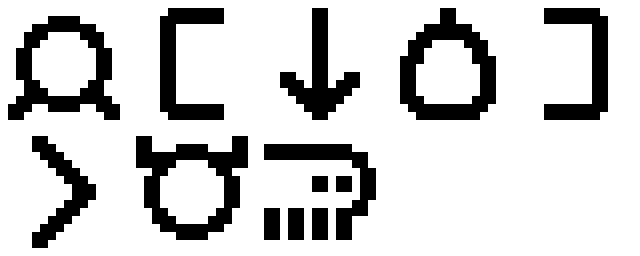

# ilo-pali-pi-sitelen-leko

## usage

generates sitelen leko images from toki pona text. sitelen leko is a 16x16 monospace font for sitelen pona that I developed for use in the nodecore mod [ncp_tokipona](https://codeberg.org/nupanick/ncp_tokipona).

endpoint currently hosted at `http://sl.hatspace.net/v2/`. For instance:

<http://sl.hatspace.net/v2/pu-li-lipu-toki-pona>  


the text after the `/v2/` in the url determines what sprites to render. all of pu and most of ku is implemented (requests welcome).

symbols and commands are escaped by putting `+` before a word instead of `-`. for instance, `+sin` adds a new line:

<http://sl.hatspace.net/v2/jan+open-ni-kili+pini+sin-li-mani-soweli>  


### symbols
- +open, nimiopen: open bracket
- +pini, nimipini: close bracket
- +wan, liliwan: one dot (full stop)
- +tu, lilitu: two dots (colon)
- +ala: nothing (space)

### commands
- +sin: new line
- +weka: transparent background
- +ante: invert color
- +suli: double scale
- +lili: half scale

the default scale is x8, so each 16px character is rendered at 128px. +suli and +lili can be repeated, so for instance +lili+lili+lili will bring it back to x1 scale.

### seximal
I've included 'san' and 'po' specifically so numbers can be written in seximal, which is a place-value system, which feels like a good fit for a monospace font.

<http://sl.hatspace.net/v2/ala-wan-tu-san-po-luka>  


<http://sl.hatspace.net/v2/+ala-wan-san+sin-kipisi-wan-po+sin-sama+ala-ala-lili-luka-sike-tu+lili>  


13 / 14 = 0.5(2). that is, nine tenths equals zero point five, two repeating.

## develop

To install dependencies:

```bash
bun install
```

To run:

```bash
bun run index.ts
```

This project was created using `bun init` in bun v1.3.5. [Bun](https://bun.com) is a fast all-in-one JavaScript runtime.
